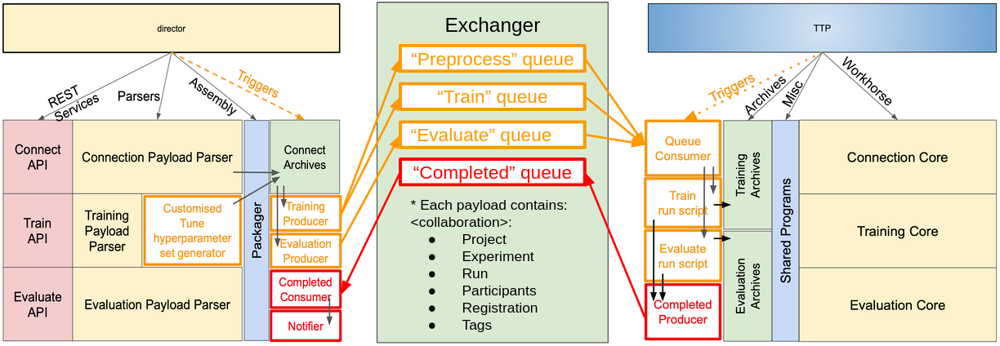
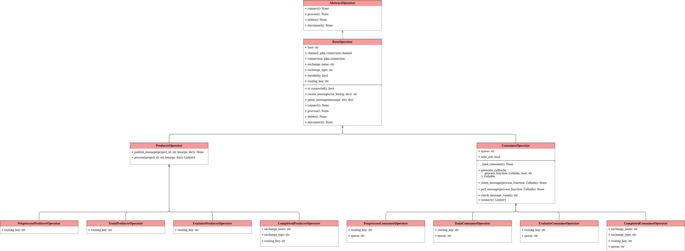

# Synergos Manager

Job management component of the Synergos network

*Component repositories of Synergos [V2]*

The Synergos grid prides itself on its modular system of deployment, comprizing various deployment combinations as seen from the diagram above. General configurations are as follows:
1. **`SME`** 
    > Simplest deployment pattern, consisting a duet of 2 containers - *Synergos-TTP* & *Synergos-Worker*. 
2. **`Monitored SME`**
    > Intermediate deployment pattern that equips the grid with the capability to for metadata extraction/analysis. This allows users to gain access to hardware statistics, data-cataloguing, lineage tracking and general centrialised logging.
3. **`SynCluster`**
    > Full distributed deployment pattern with job queue integration in addition to metadata extraction. This configuration is optimized for running concurrent federated cycles to facilitate hyperparameter tuning.

By having users install different components depending on their supposed role within the federated grid, most of the complexity associated with federated orchestrations are obscured completely from the users. Specifically, the goal is to stitch entire containers together with unique Dockerfile configurations.

This repository governs **Synergos Manager**, the primary job orchestrator for the Synergos `SynCluster` configuration.

---

## Installation
As Synergos is still under development, its components have yet to be deployed on PyPi. Hence, the best way to use Synergos Manager is to install it in development mode in a local virtualenv.

```
# Download source repository
git clone https://gitlab.int.aisingapore.org/aims/federatedlearning/synergos_manager
cd ./synergos_manager

# Setup virtual environment
conda create -n synergos_env python=3.7

# Install in development mode
pip install -e .
```
---

## How to use?
The job queue serves as a way of linearising & ranking spawned jobs from the Synergos Director (global orchestrator), before distributing them to multiple Synergos TTP targets (local orchestrators) for job execution.

*Custom manager interaction with a pre-configured message queue instance*

As seen from the diagram above, we first need to launch a customised message exchange instance. This is a pre-configured RabbitMQ container, with 4 queues - `Preprocess`, `Train`, `Evaluate` & `Completed`, each corresponding to different phrases of the Synergos Federated Cycle. More information on the procedure can be found [here](https://gitlab.int.aisingapore.org/aims/federatedlearning/fedlearn-prototype/-/wikis/Developer-Guides/Federated-Learning-A-Developer's-Diary). 

Starting the message exchange is simple: 

```
# Build customised message exhange as a container
docker build -t synergos_mq:dev --label "synergos_mq" -f Dockerfile_mq .

# Run container
docker run 
    -it --rm            # general configurations (optional)
    -p 15672:15672      # UI port
    -p 5672:5672        # AMQP port
    --name synergos_mq 
    synergos_mq:dev
```

To submit a job, use an appropriate ProducerOperator in accordance to the phrase of the federated cycle with which the job corresponds to.

```
from synmanager.preprocess import PreprocessProducerOperator

##################
# Job Submission #
##################

# Instantiate Producer Operator object
mq_host = "localhost"  # or IP of VM hosting message exchange instance
ppp_operator = PreprocessProducerOperator(host=mq_host)

# Connect to message exchange
ppp_operator.connect()

preprocess_kwarg = {'project_id': "test_project"}
ppp_operator.process(**preprocess_kwarg)

# Terminate connection with message exchange
ppp_operator.disconnect()
```

To retrieve the submitted job, open a stream using an appropriate ConsumerOperator in accordance to the phrase of the federated cycle with which the job corresponds to.

```
from synmanager.preprocess import PreprocessConsumerOperator

#############
# Functions #
#############

def perform_action(kwargs, host):
    """ Function that handles the preprocess job 
    
    Args:
        kwargs: Mandatory parameter to receive kwargs from Synergos MQ
        host: Mandatory parameter to receive IP of MQ for job redirection
    """
    ...
    return True

#################
# Job Retrieval #
#################

# Instantiate Producer Operator object
mq_host = "localhost"  # or IP of VM hosting message exchange instance
ppc_operator = PreprocessConsumerOperator(host=mq_host)

# Connect to message exchange
ppc_operator.connect()

ppc_operator.listen_message(process_callback=perform_action)

.
.
.

# Terminate connection with message exchange (if necessary)
ppc_operator.disconnect()
```
---

## Further Documentations
For now, documentations are still in progress. In the meantime, use python's `help()` function to find out existing parameters to each of the task classes. 

*Interfacing components that make up the Synergos Manager package*

Alternatively, you may refer to the UML class diagram above for the list of functions supported for each component class.